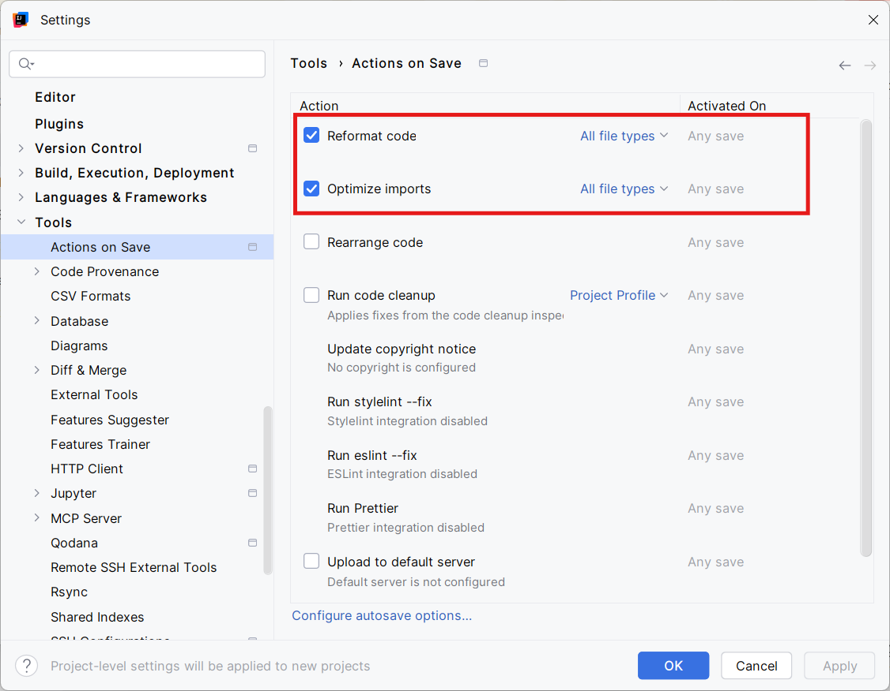

### Actions on save

Een mooie formattering van je Java code maakte het ontwikkelen van software veel eenvoudiger. We gaan IntelliJ IDEA zo configureren dat wanneer je een Java-bestand bewaart, het automatisch een mooie en consistente formattering krijgt. Ook het automatisch aanvullen van imports kunnen we hier instellen.

!!! note "Stappenplan"
    - Open het **Settings**-menu. 
    - Navigeer in het linkermenu naar **Tools > Actions on Save.**
    - Schakel de optie **Reformat code** in.
    - Schakel de optie **Optimize imports** in.
    - Klik op ++"OK"++ (of ++"Apply"++) om de wijzigingen op te slaan.

  

