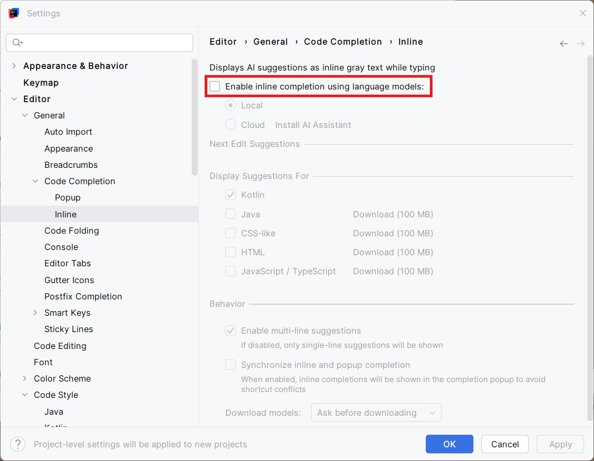

### Uitschakelen 'inline completion' ⚠️verplicht⚠️
Tijdens het maken van oefeningen en op het examen is het gebruik van inline completion (AI autocompletion) **niet toegestaan**.

!!! note "Stappenplan"
    - Start IntelliJ op
    - Open het **Settings**-menu: 
        - Windows/Linux: ++"Ctrl"++ + ++"Alt"++ + ++"S"++
        - macOS: ++"Cmd"++ + ++","++
    - Navigeer in het linkermenu naar Editor > General > Code Completion > Inline
    - Selecteer de sectie **Inline** en vink het vakje bij _'Enable inline completion…'_ uit
    - Klik op ++"OK"++ (of ++"Apply"++) om de wijzigingen op te slaan

  

> **💡Tip**: in IntelliJ kan je steeds **dubbel klikken op ++"Shift"++** om een _'Search everywhere'_ zoekactie te starten. Dubbel ++"Shift"++ en in de zoekbalk _'inline'_ intikken brengt je direct naar de gewenste sectie...
