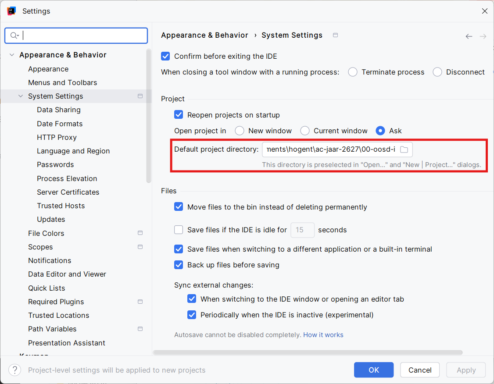

### Appearance and behavior

#### Standaard projectmap 
Deze instelling maakt het eenvoudiger om projecten te openen en aan te maken in IntelliJ IDEA. In de [inleiding](../../index.md#jouw-mappenstructuur) werd een mappenstructuur voorgesteld. 

Wil je bij het openen of aanmaken van een project steeds starten vanuit de map `00-oosd-i`? Dan kun je deze map instellen als  **default project directory**.

!!! note "Stappenplan"
    - Open het **Settings**-menu. 
    - Navigeer in het linkermenu naar **Appearance & Behavior > System Settings.**
    - Klik op het map-icoontje 📁 naast het veld **Default project directory.**
    - Selecteer de map `00-oosd-i`.
    - Klik op ++"OK"++ (of ++"Apply"++) om de wijzigingen op te slaan.

  

#### Projecten automatisch heropenen
In hetwelfde venster kun je bepalen of IntelliJ de projecten die geopend waren bij het afsluiten automatisch opnieuw opent bij het opstarten.

Wij raden aan om de volgende optie in te schakelen:

!!! note ""
    ☑️ Reopen projects on startup

#### Venster voor het openen van een project
Wanneer je een project opent terwijl er al een project geopend is, vraagt IntelliJ standaard of het nieuwe project in hetzelfde venster of in een nieuw venster moet worden geopend.

Kies onder **Open project in** één van de volgende opties:

!!! note ""
    - ⚪ **New window** — Opent het project in een nieuw venster.
    - ⚪ **Current window** — Vervangt het huidige project in het bestaande venster.
    - 🔘 **Ask** — Vraagt hoe het nieuwe project moet geopend worden. 

Wij raden aan om de standaard instelling **Ask** te gebruiken. Zo kun je per situatie kiezen wat het meest geschikt is.