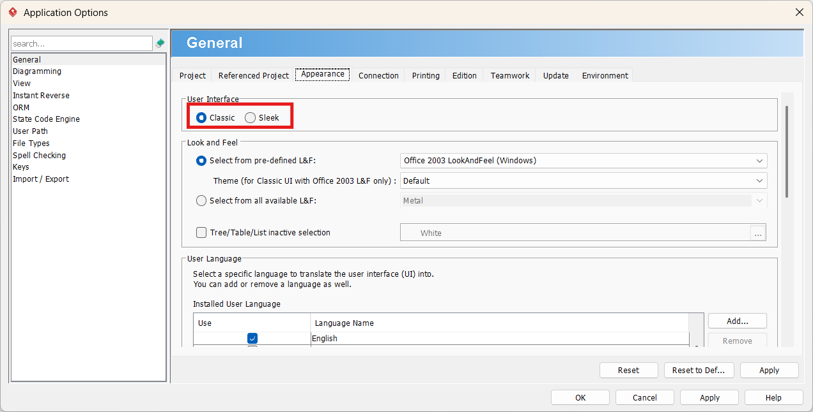

### Opmaak user interface

De standaardinstelling voor de user-interface van Visual Paradigm wijkt sterk af van klassieke applicaties. Werken met Visual Paradigm voelt veel natuurlijker aan wanneer we met de klassieke interface aan de slag gaan.

!!! note "Stappenplan"
    - Start Visual Paradigm op.
    - Selecteer in het hoofdmenu de tab **Window**.
    - Klik op **Application Options**.
    - Klik in het pop-upvenster op het tabblad **Appearance**.
    - Selecteer in de sectie **User Interface** de optie **Classic**.
    - Klik op ++"OK"++ (of ++"Apply"++) om de wijzigingen op te slaan.

    *⚠️ **Let op:** Deze verandering treedt pas in werking nadat je Visual Paradigm opnieuw opstart.*

  

