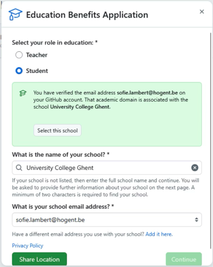
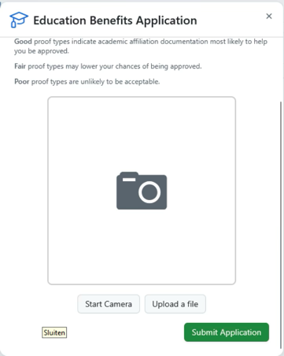
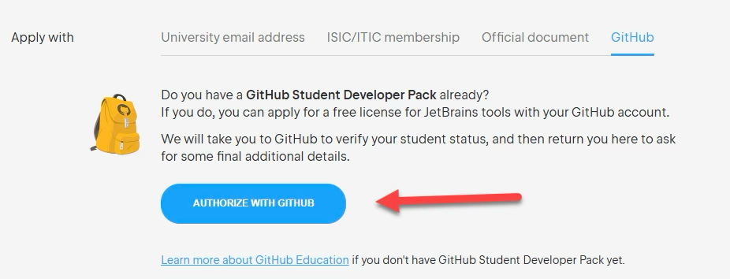
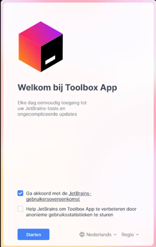
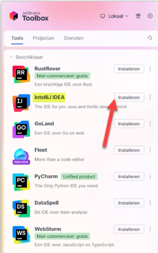
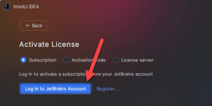
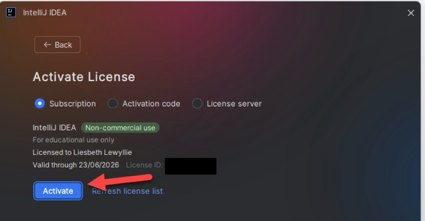
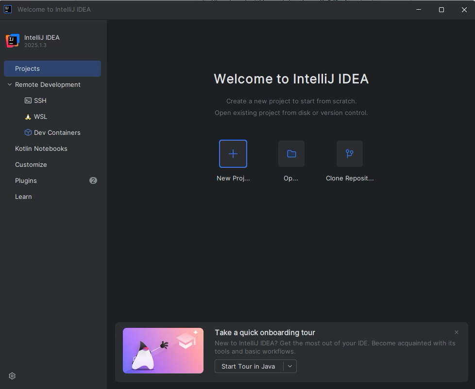

## Installatie van de IDE - IntelliJ IDEA

⚠️ **Belangrijk:** IntelliJ IDEA is een populaire  **Integrated Development Environment** van JetBrains die je gaat gebruiken om Java applicaties te implementeren, testen en uit te voeren. IntelliJ IDEA is commerciële software. Als student kun je via een gratis **educatieve licentie** toch gebruikmaken van alle professionele functies.

### Stappen 
1. [Education Benefits activeren op GitHub](#1-education-benefits-activeren-op-github). Hiermee krijg je als student toegang tot gratis proefversies van betaalde software. Bekijk ook de [volledige lijst](https://education.github.com/pack) voor andere interessante tools.
2. [JetBrains-account koppelen aan GitHub](#2-jetbrains-account-koppelen-aan-github), zodat JetBrains jouw studentenstatus herkent. 
3. [IntelliJ installeren via de JetBrains Toolbox](#3-intellij-installeren-via-toolbox)  
4. [IntelliJ-licentie activeren](#4-intellij-licentie-activeren)

### 1. Education Benefits activeren op GitHub

Het is **cruciaal** dat je een GitHub-account dat **gelinkt is aan je HOGENT-emailadres** zoals beschreven werd in [1. Een GitHub account aanmaken](github.md).

Ga naar de GitHub-pagina voor [Education Benefits](https://github.com/settings/education/benefits) en klik op de groene knop  
++'Start an application'++.

Geef aan dat je student bent, kies onze school **University College Ghent**, en vul je HOGENT-e-mailadres in.

Let op: deel ook je locatie zodat GitHub kan controleren of je je in de buurt van de school bent. Doe dit niet via een VPN of terwijl je op vakantie bent.

Lever bewijs van je studentstatus door in de dropdown de optie **Studentenkaart** te kiezen en een foto van je studentenkaart te uploaden.

Klik daarna op ++'Submit Application'++.

De volgende screenshots laten dit proces zien:

Wacht tot GitHub je aanvraag geverifieerd heeft (dit kan tot drie dagen duren). Zodra dit gebeurd is, zie je het volgende scherm bij de Education Benefits:

### 2. JetBrains-account koppelen aan GitHub

Ga naar de JetBrains-pagina voor de aanvraag van de [Educational License](https://www.jetbrains.com/shop/eform/students).

Na het oplossen van de captcha zie je de aanvraagpagina. Klik op het vierde tabje **GitHub**.

Klik op ++'Authorize with GitHub'++ om JetBrains toestemming te geven je studentstatus via GitHub te controleren.

Zorg dat je de stappen van 'Education Benefits activeren' hebt afgerond voordat je dit doet.

Klik op ++'Authorize JetBrains'++.

Vul vervolgens de gevraagde gegevens in zoals weergegeven in onderstaande screenshot.

Vink het vakje aan om de JetBrains-account Agreement te accepteren.

Klik vervolgens op ++'Apply for free products'++.

Je ziet nu een pagina met jouw licentiesleutel.

### 3. IntelliJ installeren via Toolbox

Gebruik de [JetBrains Toolbox](https://www.jetbrains.com/toolbox-app/) om IntelliJ te installeren. Hiermee kun je eenvoudig updates uitvoeren en je projecten snel openen.

Op de Toolbox-pagina wordt automatisch een downloadlink voor jouw systeem getoond. Klik op ++'Download'++.

Na het downloaden, open de installer en start de installatie door op ++'Install'++ te klikken.

Ga akkoord met de voorwaarden en klik op ++'Starten'++.

Open de Toolbox-app en ga naar het tabblad **Tools**.

Zoek de applicatie **IntelliJ IDEA** en installeer deze.

### 4. IntelliJ-licentie activeren

De eerste keer dat je IntelliJ opent, verschijnt een activatiescherm. Klik op ++'Activate License'++.

Als dit niet vanzelf verschijnt, kun je ook links onderaan op het tandwiel klikken > ++'Manage Licenses...'++

Klik op ++'Log in to JetBrains Account'++. Er opent een browservenster.

Klik in het browservenster op ++'Continue with GitHub'++ daar je je JetBrains gekoppeld hebt aan GitHub. Zo kun je eenvoudig aanmelden.

Na inloggen haalt IntelliJ je licentie op. Je ziet een scherm met jouw naam en het type licentie (educatieve licentie). 

⚠️ **Belangrijk:** een educatieve licentie mag uitsluitend worden gebruikt voor onderwijsdoeleinden en niet voor commerciële projecten

Klik op ++'Activate'++.

Als alles gelukt is, zie je nu het startscherm van IntelliJ en kun je beginnen met werken.

